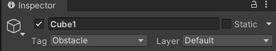

# Práctica 1: Introducción a Unity
### Autor: Lorenzo Gabriel Pérez González

## **Apartado 1**: Incluir objetos 3D básicos.
En este apartado he optado por incluir cuatro objetos de tipo cubo para representar cuatro paredes. Para ello, he pinchado en la opción **GameObject --> 3D Object --> Cube** y he ajustado las dimensiones y posiciones que quería.

## **Apartado 2**: Incluir en el proyecto el paquete Starter Assets.
Para incluir el paquete de **Starter Assets**, tuve que dirigirme a la *Asset Store* y buscar el paquete **Starter Assets**, en mi caso, elegí el de tercera persona. Posteriormente a instalarlo, en la sección de *Package Manager* lo incluí en el proyecto.

Aquí se muestra incluido en el proyecto.

## **Apartado 3**: Incluir un objeto libre de la Asset Store que no sea de los Starter Assets.

Decidí incluir el paquete *PP Super Car 01* para añadir un coche a la escena.

## **Apartado 4**: Crear un terreno.

Para este apartado, tuve que dirigirme a la sección de **GameObject --> 3D Object --> Terrain** y añadí uno por defecto.

## **Apartado 5**: Cada objeto debe tener una etiqueta que lo identifique.

Para cada objeto, me dirigí a la sección de **Tag** en el *Inspector* y los asigné mediante el siguiente esquema:

**Obstacle**: Cubos que conforman las paredes.
**Vehicle**: Coche blanco.
**DirectionalLight**: Luz de la escena.
**Terrain**: Terreno.
**Player**: Jugador de la Starter Assets (lo asignaré en el siguiente apartado).

Ejemplo de etiqueta:

## **Apartado 6**: Utilizar prefabs de Starter Asset FPS o Third Person.

En este apartado, incluí un *prefab* de un personaje que venía dentro de la **Third Person Starter Asset**.

## **Apartado 7**: Agregar un script que escriba en la consola los objetos que se han utilizado.

Elaboré un script con varios **Debug.Log** para cada objeto que interviene en el proyecto. Aquí se puede ver su salida.

